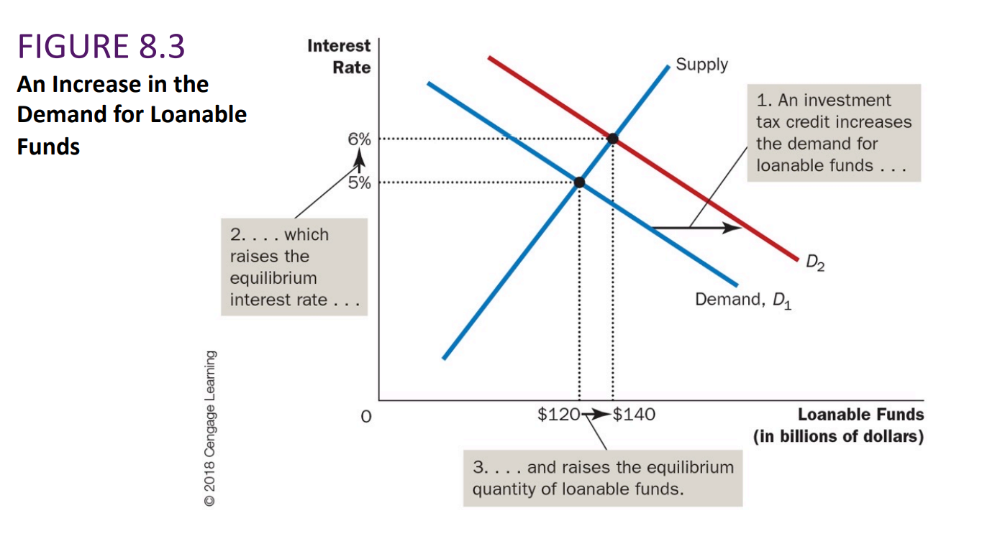

# ECO1102

## GDP 国内生产总值

### Y=C+I+G+NX

| 字母 | 英文                 | 中文                        |
| ---- | -------------------- | --------------------------- |
| Y    | GDP                  | 国内生产总值                |
| C    | Consumption          | 消费                        |
| I    | Investment           | 投资                        |
| G    | Government purchases | 政府购买                    |
| NX   | Net exports          | 净出口（出口总额-进口总额） |

### Nominal GDP 名义GDP

指的是用当前价格计算的GDP

### Real GDP 真实GDP

指的是用固定的价格（base year）的价格计算的GDP

Real GDP避免了因价格上涨而导致的差异

### GDP deflator 平均物价指数

GDP deflator= 名义GDP/真实GDP*100

### Inflation Rate 通货膨胀率

第二年的通货膨胀率 =（第二年的GDP deflator-第一年的GDP deflator）/第一年的GDP deflator *100

## CPI (Consumer price index)消费者物价指数

选择居民常见的消费内容，prices are most important to the typical consumer.

用当年的这些物品的价格/基年的这些物品的价格*100

根据CPI计算通货膨胀率

CPI无法反应

商品替代的偏见，新产品的引进，质量的变化。

这会导致CPI每年被高估0.5%

## Dollar figures from different times 不同时期的价格

收到通货膨胀的影响，单看数字很难比较以前的价格和今天的价格。

比如，与 2018 年的天然气价格(每升 1.30 美元)相比，1957 年 9.5 美分的价格是高还是低?

为了将 1957 年的天然气价格与 2018 年的价格进行比较，我们需要将每升 9.5 美分的天然气价格提高到 2018 年的水平。

公式为

换成这个例子的数据就是

比较85.4 cents 和130 cents才有意义

## Real and Nominal interest rates真实和名义利率

Nominal interest rate 名义利率，通常来说报告的利率，没有对通货膨胀的影响进行修正

Real interest rate 实际利率，根据通货膨胀影响而修正的利率

## Productivity生产力  经济的增长

穷国的增长速度会比发达国家快

世界各地生活水平的差距来源于生产力（productivity）的不同

生产力：工人每小时生产的商品和服务的数量

生产力是如何决定的

1. ### Physical capital per worker 物质资本

   用于生产商品和服务的设备和结构的存量

2. ### Human capital per worker 人力资本

   工人通过教育、培训和经验获得的知识和技能。

3. ### Natural resources per worker 自然资源

   自然界生产的商品和服务的投入，如土地、河流和矿藏。

4. ### Technological knowledge 技术知识

​		会对生产商品和服务的最佳方式的理解。

### 经济的增长与公共政策的关系

- The importance of saving and investment 储蓄和投资的重要性
- Diminishing returns and the catch-up effect报酬递减和追赶效应（对于富有的国家，再投入，效果很有限，对于穷国，一点投入就会有很大的收益）
- Investment from abroad海外投资
- Education教育（穷国会遇到人才流失，恶性循环）
- Health and nutrition健康与营养
- Property rights and political stability产权与政治稳定
- Free trade自由贸易
- Research and development研究与发展
- Population growth人口增长

## Saving, Investment and the Financial System 储蓄，投资和金融体系

- Financial system 金融系统

经济体中帮助一个人的储蓄与另一个人的投资相匹配的一组机构。

储蓄与投资是长期经济增长的关键因素。

如果一个国家，将GDP的很大一部分储蓄起来，那么更多的资源会用于资本投资，更多的资本会提高一个国家的生产力与生活水平。

- Financial Market 金融市场

储户==直接==向借款人提供资金的机构

- Bond 债券

一种债务凭证，它规定了借款人对债券持有人的义务

- Stock 股票

代表公司的所有权，是对其利润的要求权

- Equity finance 股权融资

出售股票以筹集资金

- Stock index 股票指数

一组股票的平均值，例如，Dow Jones Industrial Average, S&P 

- Financial intermediaries 金融中介

储户==间接==向借款人提供资金的金融机构

- Bank 银行

吸收储户存款，并用来给想借款的人发放贷款

- Mutual fund 共同基金

向公众出售股票，并用所得收益购买股票和债券组合的机构

- Transfer Payment 转移支付

通过政府无偿支出实现社会收入和财富再分配（社会保障，社会福利，企业补贴）

- National Saving 国民储蓄

经济中支付消费和政府采购之后的总收入

GDP的公式  Y=C+I+G+NX

在封闭的经济中：

NX=0

GDP就是 Y= C+I+G

那么 I=Y-C-G

Y-C-G也叫做National Saving国民储蓄（S）

S=I

用T表示政府收取的税减去转移支付

此时，国民储蓄可以这样表示

S=Y-C-G 或者 S=（Y- T- C）+（T- G）

- Private Saving 私人储蓄

家庭在支付税款和消费后剩余的收入

Y-T-C

- Public saving 公共储蓄

政府在支付开支后留下的税收收入

T-G

如果T<G则说明预算赤字

如果T>G则说明预算盈余

### 储蓄saving与投资investment的区别

S=I说明对整个经济来说，他们是平衡的，单对于每个家庭和企业不一定是这样。

考虑一个例子。假设拉里赚得比他花的多，他将未动用的收入存入银行，或用它购买公司的债券或股票。由于拉里的收入超过了他的消费，他增加了国家的储蓄。拉里可能认为自己是在“投资”他的钱，但宏观经济学家会称拉里的行为是*储蓄*而不是*投资*。

用宏观经济学的语言来说，*投资*是指购买新的资本，例如设备或建筑物。当 Moe 从银行借款为自己盖新房时，他增加了国家的投资。（请记住，购买新房是家庭支出的一种形式，属于投资而非消费。）同样，当 Curly Corporation 出售部分股票并用所得款项建造新工厂时，它也增加了国家的投资.

虽然S=I表明储蓄和投资对整个经济是平等的，这不一定对每个家庭或公司都是如此。拉里的储蓄可能大于他的投资，他可以将多余的部分存入银行。Moe 的储蓄可能少于他的投资，他可以从银行借到不足部分。银行和其他金融机构允许一个人的储蓄为另一个人的投资提供资金，从而使储蓄和投资之间的个体差异成为可能。

## Loanable Funds Market 可贷资金市场

希望储蓄供应资金和希望借款投资需求资金的市场

- 储蓄是可贷资金的==供给==来源。

- 投资是可贷资金的==需求==来源。

- 利率是贷款的价格

- 更高的储蓄利率会带来更高的GDP增长

### 供给、需求、可贷资金和利息图

当税上涨的时候，人们更偏向于存钱，因此市场上会提供更多的可贷资金，所以supply会向更多loanable funds的方向移动，需求不动的时候，会导致更低的利息。

当政府对投资税收做出减免的时候，市场对可贷资金的需求就会增长，所以demand会向更多loanable funds的方向移动，当supply不变的时候，这会带来更高的利息。

- Government debt 政府债务
- Crowding out 挤出效应，政府的借款会导致投资的减少

政府赤字导致市场可贷资金的供给减少，从而导致supply向更少的loanable funds的方向移动，这会带来更高的利息和更少的资金需求。

## 失业问题

**Natural rate of unemployment 自然失业率**

指经济通常经历的失业数量

**Cyclical unemployment 周期性失业**

指失业率在自然失业率附近的年复一年的波动

失业是怎么衡量的？加拿大统计局分三种情况：**Employed**， **Unemployed**， **Not in the labor force**

- **Employed** 如果一个人在前一周花了一些时间从事有偿工作，那么他或她就被雇佣了。
- **Unemployed** 如果一个人被临时解雇或正在找工作，那么他或她就失业了。
- **Not in the labor force** 如果一个人不符合前两个条件，比如全日制学生、家庭主妇或 退休人员，那么他就不是劳动力。

**Labor Force 劳动力** = 就业人数+失业人数

**Unemployment rate 失业率** = 失业人数/劳动力*100

**Labor force participation rate 劳动力参与率是成年人口的百分比** = 劳动力/成人人口总数*100

失业率的统计并不容易，也不准确，因为：

1. 不努力找工作的失业者
2. 为了领取失业保险而自称失业的人
3. 一些逃税、从事非法生意的人失业没法统计

**Discouraged searchers 灰心丧气的求职者** 想找工作，但放弃找工作的人

**Natural unemployment rate 自然失业率** 一切正常，充分就业下的失业率

**Cyclical unemployment 周期性失业** 总需求不足的失业，是由于整体经济的支出和产出水平下降即总需求不足而引起的短期失业，它一般出现在经济周期的萧条阶段。 这种失业与经济中周期性波动是一致的，在经济繁荣时周期性失业率下降，经济萧条时周期性失业率上升

**Frictional unemployment 摩擦性失业** 由于工人需要时间去寻找合适的对应其技能的工作而导致的失业。

**Structural unemployment 结构性失业** 劳动力的资源大于劳动力的需求所导致的失业，这些人失业实在等待工作机会的出现

**Efficiency Wages 效率工资** 企业为了提高工人的生产力，支付的高于均衡的工资，企业认为这可以提高工人效率，增加公司盈利能力，缺点是这可能导致劳动力过剩（失业）

效率工资理论认为有以下优势

Worker health 工人健康 

Worker turnover 工人流动率 

Worker effort 工人的努力

Worker quality 工人素质

## 货币

### 概念

**Medium of exchange 交换媒介**是买方在购买商品或服务时给予卖方的一种物品。

**Unit of account 记账单位**是人们用来公布价格和记录债务的标准。

**Store of value 价值储存**是人们用来将购买力从现在转移到未来的一种物品。

**Wealth 财富**是所有价值储存的总和，包括货币资产和非货币资产。

**Liquidity 流动性**描述了资产转换为交换媒介的容易程度。

**Commodity money 商品货币**是以具有内在价值的商品形式存在的货币。

**Fiat money 法定货币**是没有内在价值的货币，因为政府的法令而被接 受为货币。

**Currency 货币**是公众手中的纸币和硬币。

**Demand deposits 活期存款**是银行账户中的余额，存款人可以通过开支票或使用借记卡随时取款。

**Central bank 中央银行**是一个旨在调节经济中货币数量的机构。

加拿大央行的四项主要职能

- Issue currency 发行货币。
- Banker to the commercial banks 商业银行的银行家。
- Banker to the Canadian government 加拿大政府的银行家。
- Control the money supply 控制货币供应。

**Money supply 货币供应量**是经济中可用的货币数量。

**Monetary policy 货币政策**是中央银行决策者设定的货币供应量。因为货币供应的变化可以深刻地影响经济

**Reserves 准备金**是指银行已经收到但尚未贷出的存款。

**Fractional-reserve banking 部分准备金银行**是一种银行系统，其中银行只持有一小部分存款作为准备金。

**Reserve ratio 准备金率**是银行作为准备金持有的存款比例

**Money multiplier 货币乘数**是银行系统收到的每一美元所产生的货币数量。它是储备金率的==倒数==，比如准备金率为10%，那么货币乘数则为10。*存款准备金率越高，各存款银行放贷越少，货币乘数越小*

**Bank capital 银行资本**是银行所有者向机构投入的资源(即所有者权益)。银行==通过向所有者发行股权而获得的资源==

### 货币供应

央行从公众手上购买债券，可以增加货币供应

央行把债券卖给公众，可以减少货币供应

### 银行资本与杠杆

**Leverage 杠杆**是指利用借来的钱来补充现有资金用于投资。

**Leverage ratio 杠杆比率**是资产与银行资本的比率。

**Capital requirement 资本要求**是政府规定银行最低资本金额的规定。

加拿大央行控制货币的三种工具

- **Open-market operations 公开市场操作** 加拿大央行购买或出售加拿大政府债券。
- **Changes in reserve requirements 准备金要求的变动**
- **Changes in the overnight rate 隔夜利率变动**

**Bank rate 银行利率**是加拿大银行对商业银行贷款收取的利率。

**Overnight rate 隔夜利率**是商业银行之间短期贷款的利率。

央行可以通过调整银行利率来改变货币供应量，从而使隔夜利率发生相同的变化

增加隔夜利率，阻碍银行从央行借准备金，从而减少银行系统的准备金，减少货币供应量

**Quantitative easing量化宽松**是指中央银行购买和出售非政府证券或长期政府证券

**Foreign exchange market operations 外汇市场操作**是指加拿大银行购买或出售外汇

**Sterilization 冲销**是通过公开市场操作来抵消外汇市场操作的过程，从而抵 消对货币供应的影响。

**Reserve requirements准备金要求**是银行对存款必须持有的最低准备金额度的规定。

## 货币增长与通货膨胀

**Inflation 通货膨胀**是指物价总水平的上升。

**Deflation 通货紧缩**是总体价格水平的下降。

货币的价值取决于货币的供给和需求。

货币的供应由加拿大银行和银行系统控制。

对货币的需求反映了人们希望以流动形式持有多少资产。

对货币的需求有时被称为“流动偏好”

**Quantity theory of money 货币数量理论**是一种主张货币数量决定价格水平，货币 数量增长率决定通货膨胀率的理论。

一吨玉米卖了一万刀

**Nominal variables名义变量**是以货币单位计量的变量。（一万刀）

**Real variables真实变量**是以物理单位测量的变量（一吨玉米）

**Classical dichotomy经典二分法**: 名义变量和实际变量的理论分离。

**Monetary neutrality货币中性**是指货币供应量的变化不影响实际变量。

**Velocity of money货币流通速度**是指货币转手的速度

**Quantity equation数量方程**是关系到货币数量、货币流通速度和经济中商品和服务产出的美元价值的方程。

**Inflation tax 通货膨胀税**是政府通过创造货币来增加的收入

政府印钱，政府拿印的钱买东西，老百姓手上的钱就没有以前那么值钱了

### The Fisher Effect

费雪效应是名义利率对通货膨胀率的一对一调整。

Real interest rate = Nominal interest rate - Inflation rate

实际利率=名义利率-通货膨胀率

Nominal interest rate = Real interest rate + Inflation rate

名义利率=实际利率+通货膨胀率

考虑货币供应量的增长如何影响利率。在货币中性的长期来看，货币增长的变化不应该影响实际利率。毕竟，实际利率是一个实际变量。为了不影响实际利率，**名义利率必须根据通货膨胀率的变化进行一对一的调整**。因此，当加拿大银行提高货币增长率时，结果是更高的通货膨胀率和更高的名义利率。这种名义利率根据通货膨胀率进行的调整被称为费雪效应

**Shoeleather cost 鞋皮成本** 是当通货膨胀鼓励人们减少他们的货币储备时所浪费的资源。（人们多把钱放在银行拿利息，少取钱，多次跑银行）

**Menu costs 菜单成本**是改变价格的成本 （比如对一家餐厅来说决定新价格的成本、印刷新价格表和目录的成本、将这些新价格表和目录发送给经销商和客户的成本、新价格的广告成本，甚至是交易成本客户对价格变动的不满。）

### Tax Distortions 税收扭曲

政府对名义利率收税，结果就是，情况二下被收的税更多，计算下来，情况二的实际收益更少

## 贸易

**Closed economy封闭经济**是一种不与世界其他经济体相互作用的经济

**Open economy开放经济**是一种与世界各地其他经济体自由互动的经济。

一个开放的经济体通过两种方式与其他经济体相互作用

1. 它在世界产品市场上买卖商品和服务。
2. 它在世界金融市场上买卖股票和债券等资本资产。

**Exports出口**是指在国内生产并销往国外的商品和服务。

**Imports进口**是指在国外生产并在国内销售的商品和服务。

**Net exports (or trade balance) 净出口(或贸易平衡)**是一个国家的价值

出口额-进口额

**Trade balance贸易平衡**是一个国家的出口额减去其进口额，也称为净出口额。

**Trade surplus贸易顺差**是指出口额超过进口额。

**Trade deficit贸易逆差**是指进口额超过出口额。

**Balanced trade平衡贸易**是指出口等于进口的情况。

**Net capital outflow (NCO)净资本流出**(NCO)是指国内居民购买外国资产减去外国人购买国内资产。

影响NCO的变量

外国资产支付的实际利率

国内资产支付的实际利率

持有海外资产的经济和政治风险

影响外资拥有国内资产的政府政策

**Net Exports 净出口(NX)**衡量一个国家的出口和进口之间的不平衡。

==NCO=NX==

当 NX > 0 时，这个国家向外国人出售的商品和服务比从他们那里购买的要多

| Trade Deficit 贸易逆差  | Balanced Trade 平衡     | Trade Surplus 贸易顺差  |
| :---------------------- | :---------------------- | :---------------------- |
| Exports < Imports       | Exports = Imports       | Exports > Imports       |
| Net exports < 0         | Net exports = 0         | Net exports > 0         |
| Y<C+I+G                 | Y=C+I+G                 | Y>C+I+G                 |
| Saving < Investment     | Saving = Investment     | Saving > Investment     |
| Net capital outflow < 0 | Net capital outflow = 0 | Net capital outflow > 0 |

## 外汇

**Nominal exchange rate 名义汇率**是一个人可以用一个国家的货币兑换另一个国家的货 币的汇率。

**Appreciation 升值**是一种货币价值的增加，以它可以购买的外币数量来衡量。

**Depreciation 折旧**是指一种货币价值的减少，以它可以购买的外币数量来衡量。

**Real exchange rate 实际汇率**是一个人用一个国家的商品和服务交换另一个国家的商品和服务的汇率。

eg：

一份加拿大小麦售价 200 美元，一份俄罗斯小麦售价 1600 卢布。加拿大和俄罗斯小麦之间的实际汇率是多少？

要回答这个问题，首先要用名义汇率将价格换算成通用货币。

如果名义汇率为每刀 4 卢布，那么每份 200 美元的加拿大小麦价格相当于每份 800 卢布。

加拿大小麦的价格是俄罗斯小麦的一半。

实际汇率是份耳加拿大小麦兑换二分之一份俄罗斯小麦。

小麦不足以反映两种货币之间的实际汇率，应该考虑整体价格（价格指数）

加拿大篮子的价格指数（P），外国篮子的价格指数（P*），以及加元和外币之间的名义汇率（e），我们可以计算实际汇率

eg：加拿大拿铁的价格是多少比索？ 

计算实际汇率

1.25杯墨西哥拿铁=1加拿大拿铁

**Purchasing-power parity (PPP) 购买力平价**是一种汇率理论，根据这种理论，任何一种特定货币的单位都应该能够在所有国家购买相同数量的商品

购买力平价理论基于一种叫做单一价格定律 law of one price(LOP) 的原则。

LOP: 一件商品必须在所有地点以相同的价格出售。

根据购买力平价理论，一种货币在所有国家都必须具有相同的购买力。

两国货币之间的名义汇率取决于这些国家的物价

如果一刀在加拿大(以刀计价)购买的商品数量与在日本(以日元计价)购买的商品数量相同，那么每刀购买的日元数量必须反映出加拿大和日本的商品价格。

然而，汇率并不总是确保一美元在所有国家的实际价值始终相同。

- 许多商品不易交易。
- 可交易的商品并不总是完美的替代品。

**Small open economy (SOE) 小型开放经济**是一种与其他经济体进行商品和服务贸易的经济体，其本身对世界价格和利率的影响可以忽略不计。

**Perfect capital mobility 完美的资本流动性**意味着加拿大人可以完全进入世界金融市场。

**Interest rate parity 利率平价**是一种利率决定理论，根据这一理论，可比金融资产的实际利率在所有能够充分进入世界金融市场的经济体系中应该是相同的。

## 需求供给

**Recession经济衰退**是指收入下降和失业率上升的时期。

**Depression萧条**是一种严重的衰退

经济波动的三个事实

- 事实 1: 经济波动是不规则和不可预测的
- 事实 2: 大多数宏观经济数量一起波动
- 事实 3: 随着产出下降，失业率上升

**Model of aggregate demand and aggregate supply 总需求和总供给模型**是大多数经济学家用来解释经济活动围绕 其长期趋势的短期波动的模型

**Aggregate-demand curve 总需求曲线**是一条曲线，它显示了家庭、企业和政府在每个价格水平上想要购买的商品和服务的数量。

**Aggregate-supply curve 总供给曲线**是一条曲线，它显示了企业在每个价格水平上选择生产和销售的商品和服务的数量。

我们用总需求和总供给模型来分析整个经济的波动，如图所示。纵轴是经济中的总体价格水平。横轴是商品和服务的总量。总需求曲线显示了在每个价格水平下家庭、企业和政府想要购买的商品和服务的数量。总供给曲线显示了企业在每个价格水平上生产和销售的商品和服务的数量。根据这个模型，价格水平和产量的调整使总需求和总供给达到平衡。

总需求曲线告诉我们在任何给定价格水平下经济中对所有商品和服务的需求量。如图14.3所示，总需求曲线是向下倾斜的。这意味着，在其他条件相同的情况下，经济总体价格水平下降（例如P1，至P2) 往往会增加商品和服务的需求量（从Y1至Y2). 相反，价格水平的上涨会减少商品和服务的需求量。

随着价格水平下降，实际财富增加，利率下降，汇率贬值。这些影响刺激了消费、投资和净出口支出。对这些产出组成部分的支出增加意味着对商品和服务的需求量增加。

为什么总需求的曲线向下倾斜

1. The price level and consumption: The Wealth Effect 价格水平和消费: 财富效应

   产出增加，价格下降，钱包里钱的面值是固定的，但商品价格会变，当商品价格更低，人们就会变得更富有，于是就会增加消费

2. The price level and investment: The Interest Rate Effect 价格水平与投资: 利率效应

   价格下降后，人们有多余的钱，会用来投资，更多的人投资，就会压低利率，低利率使得企业贷款生产更多产品，同时低利率鼓励人们大额消费（汽车楼房）

3. The price level and net exports: The Real Exchange Rate Effect 价格水平和净出口: 实际汇率效应

   价格下降后，人们更多消费本地产品，本地产品也更多地出口到外国，这两点增加了商品的需求

长远来看，价格水平的变化并不改变商品和服务的供应。

为什么长期总供给曲线可能会移动

- 劳动力变化引起的转变

想象一下，一个经济体经历了**海外移民的增加**。因为会有更多的工人，所以提供的**商品和服务的数量会增加**。结果，**长期总供给曲线将向右移动**。相反，如果许多工人离开经济体出国，长期总供给曲线将向左移动。

长期总供给曲线的位置也取决于**自然失业率**，因此自然失业率的任何变化都会使长期总供给曲线移动。例如，如果省和地区政府大幅**提高最低工资**，**自然失业率就会上升**，经济生产的**商品和服务数量就会减少**。结果，**长期总供给曲线将移动到左边**。相反，如果就业保险制度的改革**鼓励失业工人更加努力地寻找新工作**，自然失业率就会**下降**，**长期总供给曲线就会向右移动**。

- 资本变化引起的转移

经济资本存量的**增加**会**提高**生产率，从而**提高**了商品和服务的**供应量**。结果，长期总供给曲线**向右移动**。相反，经济资本存量的**减少**会**降低**生产率以及商品和服务的**供应量**，从而使长期总供给曲线**向左移动**。

请注意，无论我们讨论的是物质资本还是人力资本，都适用相同的逻辑。机器数量或大学学位数量的增加将提高经济生产商品和服务的能力。因此，两者都会使长期总供给曲线向右移动。

- 自然资源变化引起的变化

一个经济体的生产取决于其自然资源，包括土地、矿产和天气。**新**矿床的发现使长期总供给曲线**向右移动**。天气模式的变化使农业变得更加**困难**，从而使长期总供给曲线**向左移动**。

在许多国家，重要的自然资源都是从国外进口的。这些资源可用性的变化也可以移动总供给曲线。正如我们在本章后面讨论的那样，世界石油市场发生的事件历来是总供给变化的重要来源。

- 技术知识变化引起的转变

也许今天的经济产出比一代人以前多的最重要原因是我们的技术知识进步了。例如，计算机的发明使我们能够从任何给定数量的劳动力、资本和自然资源中生产出更多的商品和服务。结果，它使长期总供给曲线向右移动。

虽然不是字面上的技术，但还有许多其他事件就像技术变化一样。例如，开放国际贸易的效果类似于发明新的生产工艺，因为它允许一个国家专注于更高生产率的行业，因此它也使长期总供给曲线向右移动。相反，如果政府通过新的法规阻止企业使用某些生产方法，可能是因为它们产生了太多污染，结果将是长期总供给曲线向左移动。

**Natural rate of output 自然产出率**是指当失业率处于正常水平时，一个经济体在长期内实现的商品和服务的生产。

技术的进步和央行增加货币的供应量，导致**供给**曲线向**右**移动

|      | **为什么短期总供给曲线向上倾斜？**                           |
| ---- | ------------------------------------------------------------ |
| 1.   | *粘性工资理论：*出乎意料的低价格水平提高了实际工资，导致企业雇佣更少的工人并生产更少数量的商品和服务。 |
| 2.   | *粘性价格理论：*出乎意料的低价格水平使一些公司的价格高于预期，这会抑制他们的销售并导致他们削减产量。 |
| 3.   | *误解理论：*意外的低价格水平导致一些供应商认为他们的相对价格已经下降，从而导致产量下降。 |
|      | **为什么短期总供给曲线可能移动？**                           |
| 1.   | *劳动力变化引起的移动：*可用劳动力数量的增加（可能是由于自然失业率下降）使总供给曲线向右移动。可用劳动力数量的减少（可能是由于自然失业率的上升）使总供给曲线向左移动。 |
| 2.   | *资本变化引起的移动：*物质资本或人力资本的增加使总供给曲线向右移动。物质资本或人力资本的减少使总供给曲线向左移动。 |
| 3.   | *自然资源变化引起的变化：*自然资源可用性的增加使总供给曲线向右移动。可用自然资源的减少使总供给曲线向左移动。 |
| 4.   | *技术变化引起的变化：*技术知识的进步使总供给曲线向右移动。可用技术的减少（可能是由于政府监管）使总供给曲线向左移动。 |
| 5.   | *预期价格水平变化引起的移动：*预期价格水平的下降使短期总供给曲线向右移动。预期价格水平的上升使短期总供给曲线向左移动。 |

经济的长期均衡点位于总需求曲线与长期总供给曲线相交处（A 点）。当经济达到这种长期均衡时，工资、价格和观念将进行调整，以便短期总供给曲线也与这一点相交。

|      | 分析宏观经济波动的四个步骤                                   |
| ---- | ------------------------------------------------------------ |
| 1.   | 确定该事件是使总需求曲线移动还是使总供给曲线移动（或两者都移动）。 |
| 2.   | 决定曲线移动的方向。                                         |
| 3.   | 使用总需求和总供给图可以看出这种转变如何在短期内改变产量和价格水平。 |
| 4.   | 使用总需求和总供给图来分析经济如何从其新的短期均衡移动到其长期均衡。 |
